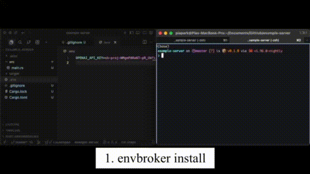

# envbroker

`envbroker` is a small Rust CLI for guarding secret variables that usually live in `.env` files, such as `API_KEY`, `SECRET_KEY`, database URLs, and access tokens, while still making them available to approved commands.

It is built for agentic coding workflows, especially high-autonomy or YOLO-style runs where an agent can move quickly and touch a lot of files and commands. Instead of relying on a fancy sandbox, `envbroker` uses a simple approach that works in practice: encrypt the real `.env`, store it outside the repository, replace the in-repo file with placeholders, and use Claude Code hooks to steer secret-dependent commands through `envbroker run`.

## Status

The current implementation focuses on:

- Claude Code integration
- `age` encryption for secret payloads
- OS keychain storage for the decryption identity
- Git-repository workflows with placeholder `.env` files

## Demo



GitHub renders GIFs directly in README files, so this is the simplest embed format.

## Why

In many repos, the most dangerous values are plain environment variables sitting in `.env`: `API_KEY`, `SECRET_KEY`, `DATABASE_URL`, service tokens, and similar credentials. That model is already easy to leak during normal development, and it gets worse when coding agents are operating with broad autonomy.

`envbroker` is meant for that practical problem. If you are running an agent in a fast, high-trust workflow, you may not want to stop and build a full sandbox or permission system first. A simple and slightly hacky guardrail is often better than no guardrail at all.

The core idea is to make the repository copy of `.env` intentionally useless while still allowing approved commands to access the real values when needed:

- real values are encrypted outside the repo
- the checked-in `.env` contains `ENVBROKER_REQUIRED` placeholders
- Claude Code is taught not to read `.env` directly
- secret-aware commands are rerun through `envbroker run`

## Installation

`envbroker` is not wired as a published crate yet, so install it from the repository:

```sh
cargo install --path .
```

Or build a release binary:

```sh
cargo build --release
./target/release/envbroker --help
```

## Quick Start

1. Create a normal `.env` in a git repository.
2. Install Claude Code integration.
3. Run your secret-dependent commands through `envbroker run`.

```sh
envbroker install claude
envbroker status
envbroker list-vars
envbroker run -- cargo test
```

After installation, the original `.env` is rewritten to placeholders like this:

```dotenv
# Managed by envbroker. Real values are encrypted outside this repository.
# ENVBROKER_ACTIVE
OPENAI_API_KEY=ENVBROKER_REQUIRED
DATABASE_URL=ENVBROKER_REQUIRED
```

## Claude Code Workflow

Example prompts:

```text
Run the test suite for this repo.
```

```text
Start the app and verify the health check passes.
```

What typically happens:

1. Claude works in the repository as usual and tries a Bash command.
2. Claude Code calls the `PreToolUse` hook before the command executes.
3. `envbroker hook pretooluse` inspects the incoming JSON payload, including the tool name, command, and current working directory.
4. If the directory is not an envbroker-managed project, the hook does nothing.
5. If Claude tries to inspect `.env` directly, the hook denies that path and keeps the agent away from placeholder files.
6. Otherwise, the command is allowed to run normally.
7. If that normal command fails because placeholder values are not usable for the task, Claude Code calls the `PostToolUseFailure` hook.
8. `envbroker hook posttoolusefailure` adds recovery context telling Claude this is likely a secrets-access problem, not a normal application bug, and points it to rerun the same command through `envbroker run -- ...`.
9. Claude then chooses an `envbroker run -- ...` command for the retry.
10. `PreToolUse` sees that `envbroker run` invocation and returns `permissionDecision: ask`, which causes Claude Code to request approval before secrets are decrypted.
11. After approval, `envbroker run` retrieves the stored identity from the OS keychain, decrypts the encrypted payload, overlays the environment variables onto the child process, and runs the requested command.

## PreToolUse Hook Logic

The installed Claude hook is intentionally small and policy-driven:

- non-`Bash` tools are ignored
- unmanaged directories are ignored
- direct reads of `.env` such as `cat .env`, `head .env`, `tail .env`, `less .env`, `more .env`, and `bat .env` are denied
- `envbroker run` commands trigger an approval prompt
- everything else is allowed through

The point is that the user can issue a normal request and let the integration handle secret access automatically. The user does not need to mention `.env`, placeholder files, or `envbroker` in the prompt.

## PostToolUseFailure Hook Logic

`PostToolUseFailure` is the recovery path:

- it runs only after a Bash command has already failed
- in an envbroker-managed project, it adds contextual guidance instead of changing the failed command directly
- it tells Claude to stop treating the failure as an ordinary debugging problem when placeholder secrets are the likely cause
- it suggests rerunning the exact command through `envbroker run -- ...`

In practice, `PreToolUse` prevents bad secret-access behavior up front, and `PostToolUseFailure` repairs the workflow when Claude first tries a normal command that cannot succeed without injected secrets.

## How It Works

1. `envbroker install claude` parses your `.env`.
2. The payload is encrypted with an `age` identity.
3. The secret identity is stored in the OS keychain.
4. Ciphertext is written outside the repository.
5. `.env` is replaced with placeholder values.
6. Claude settings and hook scripts are updated to block direct `.env` reads and guide reruns through `envbroker run`.

If Claude runs a normal command first and it fails because placeholders are not usable for that task, the `PostToolUseFailure` hook adds recovery guidance telling Claude to stop treating it as a normal app failure and rerun through `envbroker run -- ...`.

## Command Reference

```text
envbroker install claude [--scope <local|project|user>] [--env-file <path>] [--profile <name>]
envbroker uninstall claude [--scope <local|project|user>]
envbroker run [--profile <name>] -- <command>...
envbroker status
envbroker doctor
envbroker list-vars [--profile <name>]
```

Useful examples:

```sh
envbroker install claude --scope local --env-file .env --profile default
envbroker run -- cargo run
envbroker run -- npm test
envbroker doctor
envbroker uninstall claude
```

## Files and Data

In the repository:

- `.env` becomes a placeholder file
- `.envbroker/config.json` stores repo-local metadata
- `.claude/hooks/envbroker-pretooluse` and `.claude/hooks/envbroker-posttoolusefailure` are created
- Claude settings are updated with a deny rule for `Read(./.env)` and envbroker hook entries

Outside the repository:

- encrypted secrets are stored under the platform app-data directory for `envbroker`
- project metadata is stored alongside the encrypted payload
- the decryption identity is stored in the OS keychain under the `envbroker` service

## Caveats

- Run `envbroker` inside a git repository. Project discovery walks upward until it finds `.git`.
- Current agent installation flow is Claude-specific.
- The repository code currently uses the Apple Keychain backend for `keyring`.

## Development

```sh
cargo fmt
cargo test
cargo run -- --help
```

## License

MIT. See [LICENSE](LICENSE).
